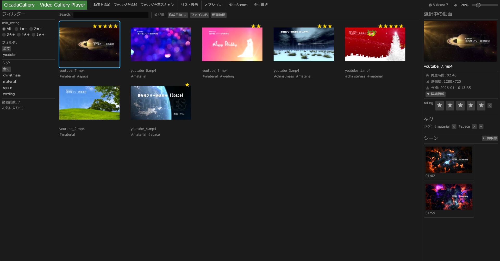
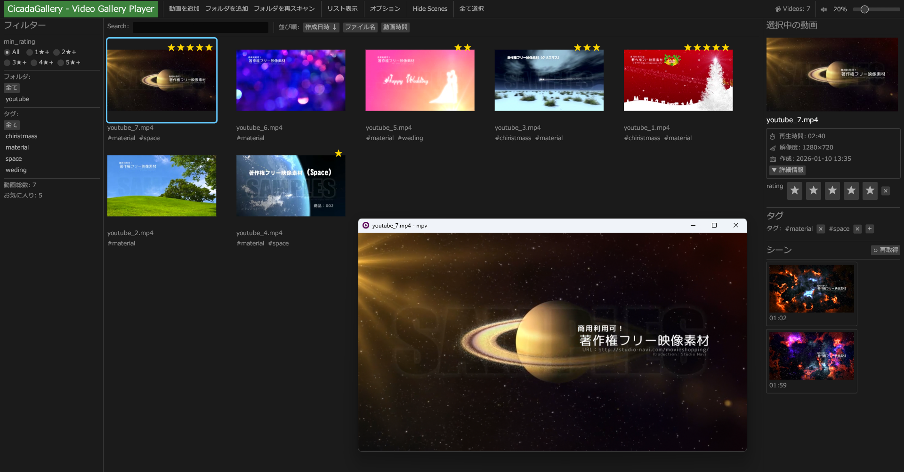

**🇯🇵 日本語** | [🇺🇸 English](en/index.md)

# CicadaGallery

**Rust製の動画管理・再生アプリケーション**

あなたの動画を飾りましょう。
このソフトはRust製の高速・軽量の動画専用ギャラリーです。
思い出や成果物の管理はもちろん、コレクション用途でも。

---

## 特徴

🎬 **シンプルで高速** - Rustで書かれた軽量なアプリケーション

📁 **柔軟な整理機能** - タグとフォルダで動画を整理

🖼️ **自動サムネイル生成** - FFmpegによる高品質なサムネイル

🌍 **多言語対応** - 日本語・英語をサポート

📺 **高品質再生** - MPVプレイヤーによる高性能な動画再生

💿 **自動バックアップ** - 3日ごとの自動バックアップで3世代管理

---

## スクリーンショット

---

## クイックスタート

1. [ダウンロードページ](download.md)から最新版をダウンロード
2. ZIPファイルを展開
3. `cicada_gallery.exe` を実行
4. 動画ファイルまたはフォルダをドラッグ＆ドロップで追加

---

## サポートする動画形式

MP4, AVI, MKV, MOV, WMV, FLV, WebM, M4V, MPG, MPEG

---

## リンク

- [機能一覧](features.md)
- [ダウンロード](download.md)
- [よくある質問](faq.md)
- [GitHub リポジトリ](https://github.com/tetdarth/cicadagallery)

---

## ライセンス

本ソフトウェアは購入者本人に対してのみ使用を許諾します。
第三者への再配布、転載は禁止します。
